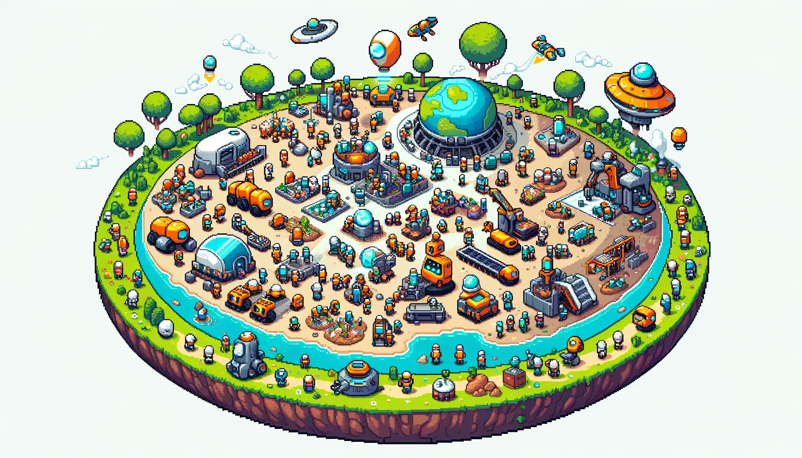

# 🤖🤝🤖 Netmind.AI-XYZ

- Netmind.AI-XYZ Project
  - This is an open-source LLM based multi-agent system development framework. 
  - With a platform: We will give Netmind.AI-XYZ to develop a platform facilitates the sharing of artificial intelligence agents. 
- Constructing a society composed of and governed by artificial intelligence.
- This project aims to explore how collective intelligence and agent-related technologies can be synergistically utilized to enhance the overall intelligence of AI systems.

<div align="center">

   
[](https://netmind.ai)   

</div>



## Overview

🤖 As AI large language models (LLMs) rapidly evolve, both in terms of algorithms and their ever-expanding scale, we are witnessing the dawn of a new AI era. Built on LLMs and equipped with **various auxiliary tools**, the concept of Agents has become increasingly clear—an entity with long-term memory, self-awareness, logical thinking, planning, reflection, and even motivation and emotion. The race to strengthen these intelligent Agents is ongoing. However, the Netmind.AI-XYZ Project is focused on a different dimension: **collective intelligence**. 💭

🌍🔧 Characterized by a focus on the core cognitive abilities of agents: memory, motivation, consciousness, and cognitive processes supports structural mechanisms that facilitate collaboration and ensure sustainable evolution and competitive governance. 

🛠️📈 Drawing on a wealth of related work, our framework integrates the latest in LLM developments, autonomous agent development, communication strategies, and AI alignment technologies. It positions itself as a pioneering solution to the challenges of agent collaboration, autonomy, and task generalization. 

🌐🤝 Furthermore, based on the XYZ package, we are launching the **XYZ platform** where agents developed using the XYZ framework can be uploaded to our AI Society, contributing to productivity through collaborative efforts. 

🏛️🚀 Utilizing the Netmind.AI-XYZ project, we will construct an **AI-Society**(composed of and governed by AI) aimed at surpassing human productivity and creativity through the enhanced capabilities of agent societies. 

## News

🌟 Apr. 17, 2024: Netmind.AI-XYZ is now open source.

## Strategic Plan

This is our comprehensive plan for the first phase of the Netmind.AI-XYZ project.

### Sub-phase 1: Multi-Agent Development 🛠️
- Milestone: Develop a series of multi-agent systems(AI-Company) to address a variety of real-world tasks. 
### Sub-phase 2: Integration with the XYZ Platform 🔗
- Milestone: Implement a platform which can let user sharing their agent and AI-Company.
### Sub-phase 3: Self-Driven Module 🧭
- Milestone: Self-driven capabilities be added to AI-Company.
### Sub-phase 4: Efficient AI-Society Structure 🌐
- Milestone: Build a society composed of AI entities where autonomous cooperation, competition, and management relationships emerge.
  
## Installation

```bash
pip install netmindaixyz
```

## Quick Tour

(TODO: 
1. Add some basic using method.
2. Show one example.
3. Introductionthe whole current task special AI-Company
)

## Contribution

Netmind.AI-XYZ is an open-source framework dedicated to multi-agent development. We are eager to collaborate and greatly appreciate contributions from the community. Here’s how you can get involved:

### Theoretical Contributions:
If you wish to contribute theoretical insights or ideas, please submit an issue using the template specified in our guidelines.

### Technical Contributions:
To make a technical contribution to the project, please follow these steps:

- Fork the Repository: Start by forking the repository to your GitHub account.
- Create a New Branch: Establish a new branch in your forked repository specifically for your development work.
- Develop: Before you begin developing, please review our requirements in the pull request template. Make your changes or add new features in this branch.
- Git Rebase: Compress all your commits in one. 
- Submit a Pull Request: Once you are ready, send a pull request from your branch. Ensure that your pull request details the changes made and their purpose.
- Additional Setup Requirements:

We look forward to seeing your contributions and thank you for your interest in improving the Netmind.AI-XYZ framework!

TODO: Instructions for setting up a virtual environment, conducting tests, etc.

## Support 

If you have a great idea or discover any issues, don't hesitate to contact us at: blacksheep@netmind.ai

## Citation

```latex
@misc{netmindaixyz,
  author = {BlackSheep, Netmind.AI},
  title = {Netmind.AI-XYZ},
  year = {2024},
  publisher = {GitHub},
  journal = {GitHub Repository},
  howpublished = {\url{https://github.com/protagolabs/Netmind-AI-XYZ/tree/main}},
  note = {Accessed: April 22, 2024}
}
```

## 🌍 Netmind.AI-XYZ contributors

[](https://github.com/protagolabs/Netmind-AI-XYZ/graphs/contributors)

